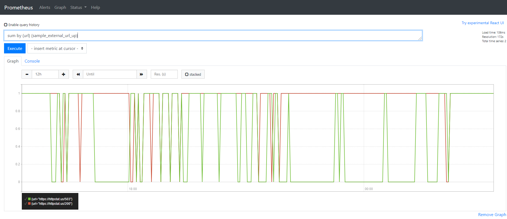
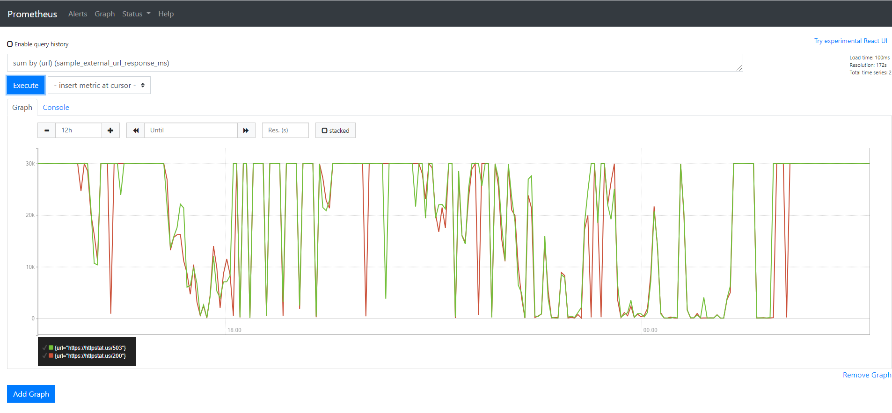
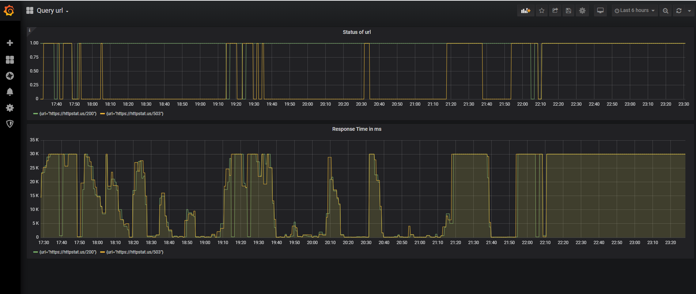

# python-prometheus

<!-- TOC START min:3 max:5 link:true update:true -->
- [Requirements](#requirements)
- [Design](#design)
  - [Application Endpoints](#application-endpoints)
  - [Scheduled Job](#scheduled-job)
  - [Unit Tests](#unit-tests)
- [Build](#build)
- [Deploy](#deploy)
   - [Prerequisites](#prerequisites)
   - [External Configs](#external-configs)
   - [Steps](#steps-to-deploy)
   - [Adding to Prometheus](#adding-the-application-endpoints-to-prometheus)
- [Application Usage](#application-usage)
- [Screenshot of Prometheus](#screenshot-of-metrics-on-prometheus)
- [Screenshot of Grafana](#screenshot-of-metrics-on-grafana)
<!-- TOC END -->

This project is an application which queries status of specified urls.

## Requirements

Run the application on http server which queries status of specified urls and these metrics are output to /metrics endpoint.

## Design

This application is written in Python using [Flask](https://flask.palletsprojects.com/en/1.1.x/) framework. The application can be accessed at ```<application-url>/queryurl``` and the metrics can be accessed at  ```<application-url>/metrics```. A docker image is built to run the application as container, the project also includes deployment script to run the application on Kubernetes. As part of design, I have considered to have a timeout of 30s while querying an url, this time value is part of external configuration and can be adjusted as needed. The application has a background job which can be set to run at desired interval to query the urls periodically.
  
### Application Endpoints
 - /healthcheck -   This is to monitor health of the application and that the application can serve requests.
 - /queryurl -    This is the main part of the application which queries for specified urls and responds with a JSON object as the result. This also adds the result to [Prometheus client ](https://github.com/prometheus/client_python) library objects.
 - /metrics -    This endpoint replies with a response object conatining the metrics tracked by prometheus client library. Prometheus server scrapes this endpoint to receive latest metrics.
   
### Scheduled Job
  This application utilizes BackgroundScheduler from [apscheduler](https://apscheduler.readthedocs.io/en/stable/userguide.html) to periodically run the query-url functionality at specified interval.
   
### Unit Tests
Unit Tests are written in file ``` python-prometheus/unit_tests.py ```. With http server running, execute this file to run unit tests.

```bash
$ python unit_tests.py
..
----------------------------------------------------------------------
Ran 2 tests in 184.769s

OK
```

## Build

Please make sure that docker is installed for below steps to work.

Steps for docker build.
```bash
$ cd python-prometheus/
$ cat ~/GH_TOKEN.txt | docker login docker.pkg.github.com -u <username> --password-stdin 
$ docker build -t query-url:<version> .
$ docker tag <IMAGE_ID> docker.pkg.github.com/<username>/<project-name>/query-url:<VERSION>
$ docker push docker.pkg.github.com/<username>/<project-name>/query-url:<VERSION>
```

Please replace username, project-name, IMAGE_ID and VERSION with appropriate values.

## Deploy

This application can be hosted on kubernetes. 

### Prerequisites
These applications need to be installed on the host for deploying the application.
- [Docker](https://www.docker.com/)
- [kubernetes](https://kubernetes.io/)
- [Prometheus](https://prometheus.io/)
- [Grafana](https://grafana.com/)

### External Configs

This application takes the configurations from ``` config/config.py ```

```bash
$ cat python-prometheus/config/config.py
urls=["https://httpstat.us/503", "https://httpstat.us/200"]
request_timeout_in_seconds=30
query_interval_in_seconds=300
log_level="INFO"
```
Each configuration purpose and expected values are described below:

<table>
  <tr>
    <th>Config Key</th>
    <th>Purpose</th>
    <th>Data type</th>
    <th>Expected Value</th>
  </tr>
  <tr>
    <td>urls</td>
    <td>All the urls to be queried</td>
    <td>List (containing urls)</td>
    <td><pre>[ 
  "https://httpstat.us/503" ,
  "https://httpstat.us/200"
 ] 
 (additional urls can be added as needed)</pre></td>
  </tr>
  <tr>
    <td>request_timeout_in_seconds</td>
    <td>This config is to time out requesting an url after the mentioned seconds</td>
    <td>Integer</td>
    <td>30 (or as per need)</td>
  </tr>
 <tr>
    <td>query_interval_in_seconds</td>
    <td>This config is to periodically run the function which queryies urls after the mentioned seconds</td>
    <td>Integer</td>
    <td>300 (or as per need)</td>
  </tr>
 <tr>
    <td>log_level</td>
    <td>To control log level</td>
    <td>String</td>
    <td>one of DEBUG, INFO, WARNING, ERROR, CRITICAL</td>
  </tr>
</table>

A ConfigMap is created from file- ```config/config.py ``` and is mounted as a volume into the container. Creating this ConfigMap is automated as part of deploy script, hence if the configs need to be changed, below shown ``` kubernetes/configmap.yaml ``` can be updated as needed and then go ahead with deployment step mentioned below.

```bash
$ cat python-prometheus/kubernetes/configmap.yaml
---
apiVersion: v1
data:
  config.py: |
    urls=["https://httpstat.us/503", "https://httpstat.us/200"]
    request_timeout_in_seconds=30
    query_interval_in_seconds=90
    log_level="WARNING"
kind: ConfigMap
metadata:
  creationTimestamp: null
  name: query-url-config
  namespace: query-url
```
Note: If you prefer updating ```config/config.py ``` to ``` kubernetes/configmap.yaml ```, then please follow below steps:

```bash
$ ls
config  deploy.sh  Dockerfile  images  kubernetes  main.py  README.md  requirements.txt  unit_tests.py
$  kubectl get namespace  query-url
NAME        STATUS   AGE
query-url   Active   2m29s
$ kubectl delete configmap query-url-config -n  query-url
configmap "query-url-config" deleted
$ kubectl create configmap query-url-config --from-file=config/ -n query-url
configmap/query-url-config created
```

## Steps to deploy
```bash
$ cd python-prometheus/
$ sh deploy.sh 
namespace/query-url created
configmap/query-url-config created
secret/git-reg-cred created
deployment.apps/query-url created
service/query-url-service created
deployment is successfully rolled out
```

Above deploy scripts creates:
- New namespace called query-url on k8s cluster. All the resources are created inside this namespace( so it can be easier ti delete everything related to this application in one shot)
- ConfigMap called query-url-config. This contains the queries that the application queries. In case we need to add more urls, we can update the configmap and restart deployment.
- Secret called git-reg-cred which had READ packages token to download docker image from Github.
- Deployment called query-url. This uses the configmap and secret that are created above. configmap is mounted as a volume. It also contains readinessProbe to check the container health before it is ready to requests.
- Service called query-url-service which exposes query-url deployment at port 32000 with internal DNS url(Example: query-url-service.query-url.svc.cluster-domain.example) inside the cluster. Service creaion is not required if there is no need to expose the deployment and be removed by commenting the line ``` kubectl apply -f kubernetes/service.yaml ``` from deploy.sh script.

When the deployment is complete the resources on k8s cluster should look something like this:

```bash
$ k get all  -n query-url
NAME                            READY   STATUS    RESTARTS   AGE
pod/query-url-79bbf79cd-9t7s6   1/1     Running   0          100s

NAME                        TYPE        CLUSTER-IP       EXTERNAL-IP   PORT(S)     AGE
service/query-url-service   ClusterIP   10.110.232.152   <none>        32000/TCP   15m

NAME                        READY   UP-TO-DATE   AVAILABLE   AGE
deployment.apps/query-url   1/1     1            1           15m

NAME                                   DESIRED   CURRENT   READY   AGE
replicaset.apps/query-url-79bbf79cd    1         1         1       100s
```

### Adding the application endpoints to Prometheus
The pods running the application contain below annotations.

```bash
  annotations:
        prometheus.io/scrape: "true"
        prometheus.io/port: "8080"
```
So Prometheus (that's setup on the same k8s cluster) will start scraping metrics when the pods are created.


## Application Usage
The application can be accessed at ```<application-url>/queryurl``` and the metrics can be accessed at ```<application-url>/metrics``` .
  
A sample of /metrics can be seen here:

```bash
$ curl http://10.110.232.152:32000/metrics
# HELP sample_external_url_response_ms Response Time of the url
# TYPE sample_external_url_response_ms gauge
sample_external_url_response_ms{url="https://httpstat.us/503"} 2522.0440000000003
sample_external_url_response_ms{url="https://httpstat.us/200"} 1868.4289999999999
# HELP sample_external_url_up Status of the url
# TYPE sample_external_url_up gauge
sample_external_url_up{url="https://httpstat.us/503"} 0.0
sample_external_url_up{url="https://httpstat.us/200"} 1.0
```

## Screenshot of metrics on Prometheus

Queries used for both Prometheus and Grafana are ``` sum by (url) (sample_external_url_response_ms) ``` and ``` sum by (url) (sample_external_url_up)```




## Screenshot of metrics on Grafana



