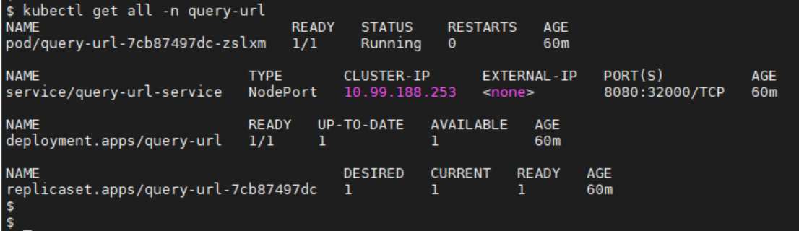

# python-prometheus

This project runs an application which queries status of specified urls and is written in Python using Flask.

## Requirements

Run the application on http server which queries status of specified urls and these metrics are output to /metrics endpoint

## Build

Please make sure docker is installed for below steps to work.

Steps for docker build.
```bash
$ cd python-prometheus/
$ cat ~/GH_TOKEN.txt | docker login docker.pkg.github.com -u <username> --password-stdin 
$ docker build -t query-url:<version> .
$ docker tag <IMAGE_ID> docker.pkg.github.com/<username>/<project-name>/query-url:<VERSION>
$ docker push docker.pkg.github.com/<username>/<project-name>/query-url:<VERSION>
```

Please replace username, project-name, IMAGE_ID and VERSION with appropriate values.

## Deploy

This application can be hosted on kubernetes. 

These softwares need to be installed on the host for deploying the application.
- docker
- kubernetes
- prometheus
- grafana

Steps to deploy
```bash
$ cd python-prometheus/
$ sh deploy.sh 
```

Above deploy scripts creates:
- New namespace called query-url on k8s cluster. All the resources are created inside this namespace( so it can be easier ti delete everything related to this application in one shot)
- ConfigMap called query-url-config. This contains the queries that the application queries. In case we need to add more urls, we can update the configmap and restart deployment.
- Secret called git-reg-cred which had READ packages token to download docker image from Github.
- Deployment called query-url. This uses the configmap and secret that are created above. configmap is mounted as a volume. It also contains readinessProbe to check the container health before it is ready to requests.
- Service called query-url-service which exposes query-url deployment at port 32000 on Node and at 8080 inside the cluster.

When the deployment is complete the resources on k8s cluster should look something like this:



